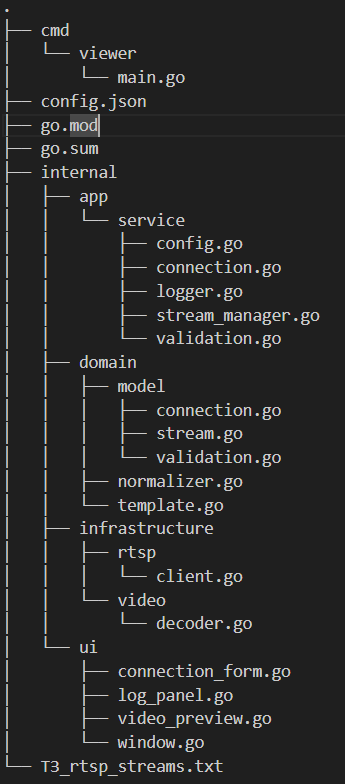
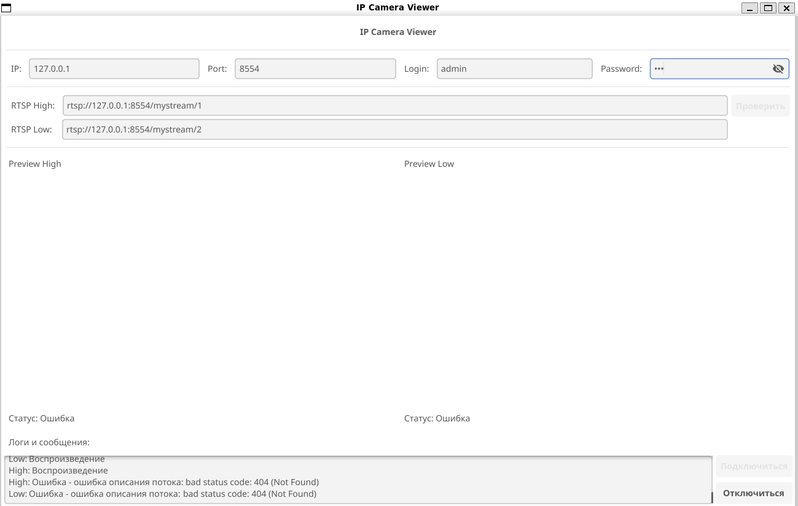
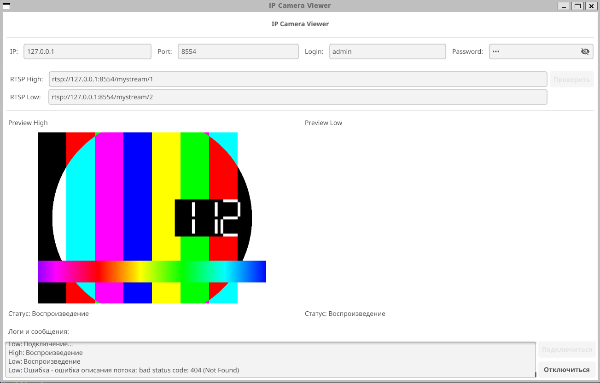
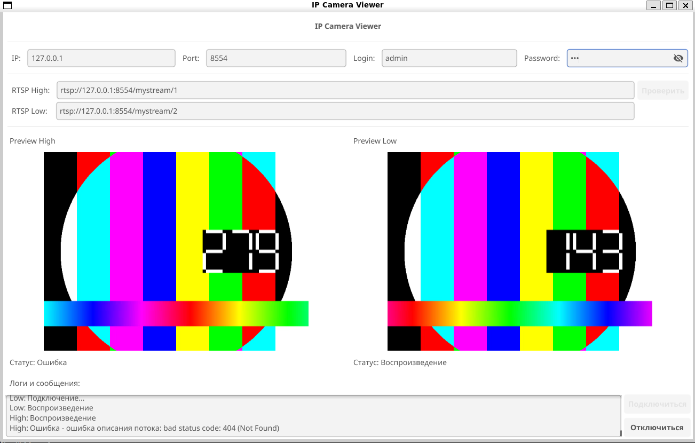
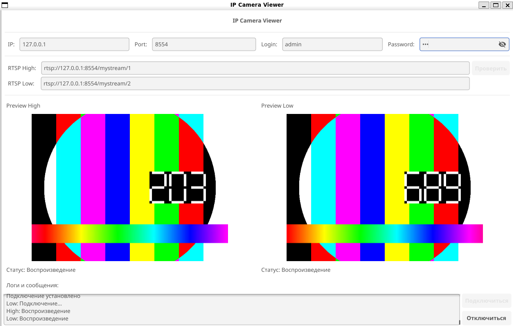

Струтура проекта выглядит таким образом:

Старался все элементы приложения распределеить по слоям, согласно принципам
"Чистая архитектура".
1. cmd/viewer/main.go - точка входа
2. internal/app - находятся все элементы программы: логика приложения,
   доменная область, инфраструктура(клиентская часть), UI приложения.

Стэк:
1. Для UI был взят fyne
2. для медиа был взят: pion/rtp, mediacommon, gortsplib.

Рассмотрим internal:
1. app/service:
    1. config.go - сохранение для конфигурации
    2. connection.go - координация процесса для подключения к rtsp-потоку
    3. logger.go - логгирование
    4. stream_manager.go - управление rtsp-потоками
    5. validation.go - центральная валидация
2. app/domain:
    1. model - содержит струтуры для подключения, валидации, Ошибки
    2. template.go - корректная подстановка допустимых плейсхолдеры
    3. normalizer.go - нормализация rtsp URI
3. app/infrastructure:
    1. rtsp/client.go - клиент для подключения к rtsp потоку
    2. video/decoder.go - декодер для H.264 → RGBA и конвертация в image.Image
4. app/ui:
    1. connection_form.go - часть ui для того что бы вбивать данные для соединения
    2. log_panel.go - часть ui для вывода логов и подсказок
    3. video_preview.go - кастомный виджет для видео
    4. window.go - центральный пакет для сборки всего ui

Скриншоты приложения:
1. Начальное окно.

2. Подключение одного потока.

3. Подключение обоих потоков.
